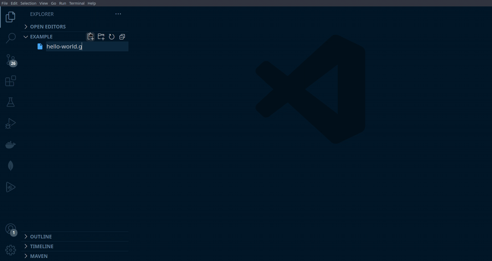

# Go Playground [VSCode](https://code.visualstudio.com/) Extension

### Play with Go in your own Playground.

### This extension can help those who want to start learning `GO` or experiment with `golang` without creating projects or even installing the compiler locally.

---

## Getting started
- [How to install](#installation)
- [Extension Settings](#extension-settings)
  - [Commands](#commands-list)
  - [Keywords](#keywords)
- [Releases](#release-notes)

## Installation

Launch __VS Code__ Quick Open (`Ctrl+P`), paste the following command, and press enter.
```
ext install ArtsemHutarau.go-playground
```

Or follow the [marketplace](https://marketplace.visualstudio.com/items?itemName=ArtsemHutarau.go-playground) link for more info.

## Extension Settings

This extension contributes the following settings:

### Commands List

* `go-playground.play`: activates extension (call the **currently open** .go file to play if provided)
* `go-playground.changeSanboxDir`: changes path of the [sandboxes directory](#keywords)
* `go-playground.refreshSanboxDir`: refreshes [sandboxes directory](#keywords)
* `go-playground.newSandbox`: creates new [sandbox](#keywords)
* `go-playground.newToy`: creates new [toy](#keywords)
* `go-playground.newEnv`: creates new [environment](#keywords)
* `go-playground.cancelRunning`: cancel running playground command

### Keywords

> **Environment** - the command (or list of commands) to launch the sandbox. May contain any OS-specific directives.
```bash
example> go run main.go 
```

> **Sandox** - in the current version of the extension, it's just a file with `.go` extension.

> **Sandoxes Directory** - directory that contains the sanbox files (with `.go` extension). Used to store all sandbox files in one place.

> **Toy** - predefined `go`-code to play with.

> **Notebook** - consists of a sequence of cells and their outputs. The cells of a notebook can be either Markdown cells or code cells, and are rendered within the core of VS Code.

## Release Notes

## [0.4.0] [0.4.1]

- Added `Cancel running` button on StatusBar to cancel current running operation.
- Adeed notebooks support for running go code from the `*.gobook` files.

See example file [hello-world.gobook](resources/examples/hello-world.gobook)

## [0.3.0]

- Added `Wiki` view.

### 0.2.0

- Added `Environments` view.
- Added possibility to define `custom` toys.
- Fixed bugs.

### 0.1.0

- Fixed bug with `undefined` file name for a new created sandbox
- Added extension icon
- Added async output for local runned sandboxes

### 0.0.2

- Fixed bug with `undefined` initial value for a new created sandbox
- Sandbox directory settings are now saved in the `global` target space
- Added commands description

### 0.0.1

- Initial release
